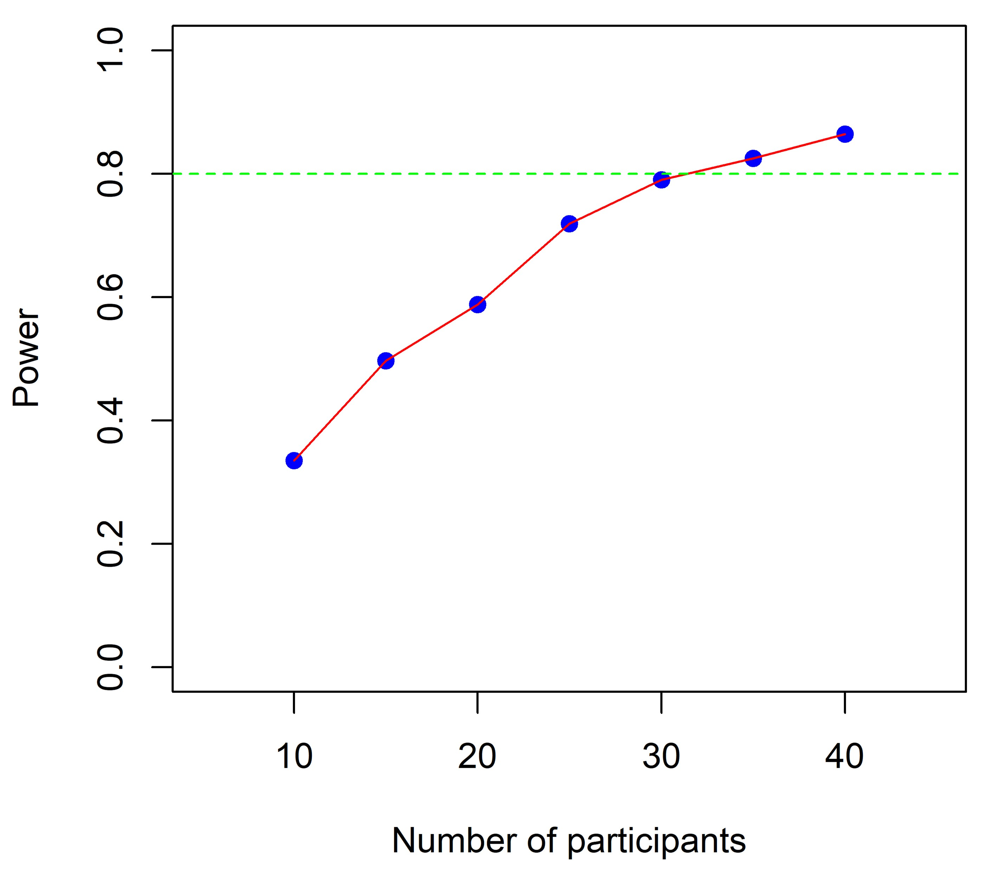

# Cognitive2Computation

## Experimental Design

### Power Analysis
With a given experimental materials, a [Power Analysis](./DOE.Rmd) was conducted to validate the number of participants. See the an example result for 2-by-2 experimental design within subject and target word (which are fully crossed) as following: 

